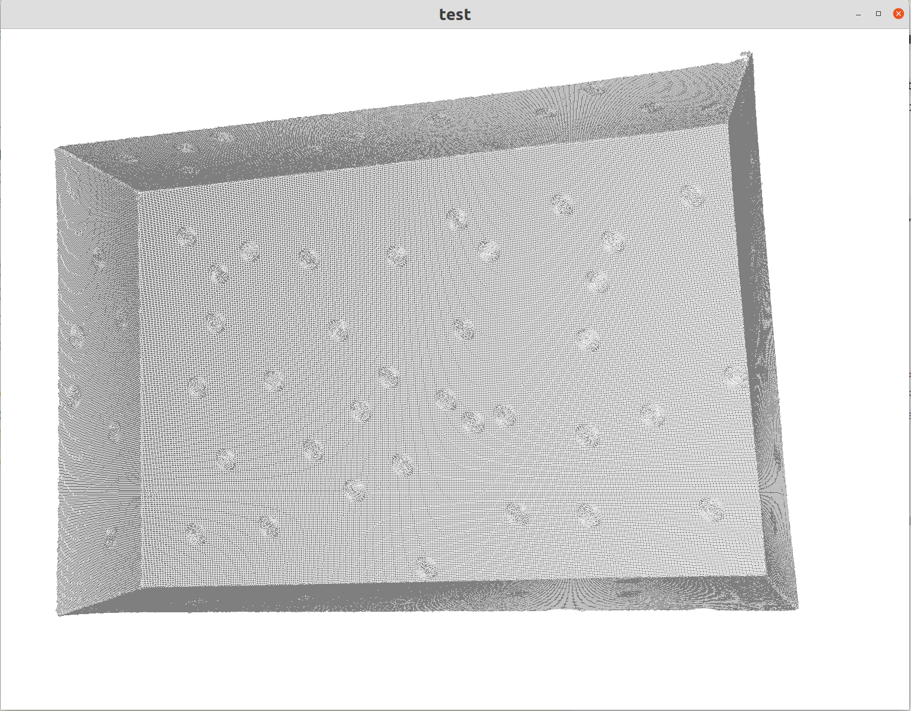

# pcl_rs

A pure trust PCL tool that includes functions such as reading PCD files and displaying point clouds, which can be used in conjunction with ros_pointcloud2

## Features

- **Read PointCloud From PCD File**
  - `src/io/io_read.rs` => `load_from_pcd`
- **Visualize PointCloud**。
  - `Implement types::type_traits::Point3DVisible trait for point cloud types`
  - `src/visual/point_cloud_viewer.rs` => `Use Struct CloudViewer`

## PointCloud Visualization



## Usage

```rust
use ros_pointcloud2::pcl_utils::{PointXYZ,PointXYZI,PointXYZRGB,PointXYZRGBA,PointXYZRGBNormal,PointXYZINormal,PointXYZL,PointXYZRGBL,PointXYZNormal};
pub mod types;
pub mod io;
pub mod visual;
use crate::types::PointCloud;
use crate::io::load_from_pcd;
use crate::visual::CloudViewer;
fn main() {
    let cloud1 = load_from_pcd::<PointXYZ>("xxx.pcd").unwrap();
    let cloud2 = load_from_pcd::<PointXYZRGB>("xxx.pcd").unwrap();
    let mut cloud_viewer = CloudViewer::new("test");
    cloud_viewer.add_cloud(&cloud1);
    println!("{:?}",cloud1.size());
    cloud_viewer.show();
}
```

## Road Map
- [x] Read PointCloud From PCD File(**Only ASCII Format Now**)
- [ ] Read PointCloud From More Format File
- [ ] KNN Search
- [ ] ICP 